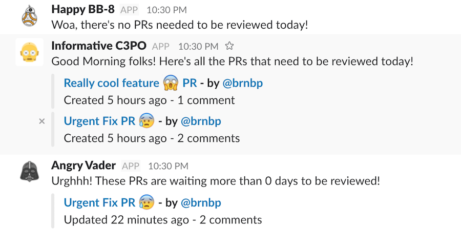

### PROBOT - Pull Requests Robot Assistent

probot is an assistant for your organization's open pull requests, build on top of NodeJS.




#### Installation

#### Minimum requirements:
  - node: >= 7.6

Configuration:
 #### 1. rename .env.example file to .env and fulfill the following things:
    - GITHUB_ACCESS_TOKEN    = your github access token (see https://github.com/settings/tokens)
    - GITHUB_ORGANIZATION    = your github organization name
    - GITHUB_STALE_DAYS      = the number of days that a pull request without any movement is considered stale

    - SLACK_HOOK             = slack webhook (see https://slack.com/services/new/incoming-webhook)
    - SLACK_CHANNEL          = slack channel to place the bot

    - ROBOT_INFORMATIVE_NAME = he's the one that keeps the team updated with all opened PRs, give him a name
    - ROBOT_INFORMATIVE_IMG  = choose a nice photo, he's a great robot

    - ROBOT_HAPPY_NAME       = he's the one that celebrates, with your team, the PRs that are closed/merged, give him a name
    - ROBOT_HAPPY_IMG        = he deserves an awesome photo

    - ROBOT_ANGRY_NAME       = better not know him, if he appears, things are going bad, give him a name
    - ROBOT_ANGRY_IMG        = well, choose a photo right from your nightmares here


You need to install the script manually by following a few steps:

1. Fetch a copy of this repository.
   ````
     Ex: 
       $ git clone git@github.com:brnbp/probot.git && cd probot
   ````

2. Navigate to the folder where you fetched the repository and install dependencies:
   ````
    $ yarn 
    or
    $ npm install
   ````

3. Make sure the file called `robot` is executable:
   ````
   chmod +x ./bin/robot
   ````

## Usage

   ````
     robot morning       Verifies and tells the team about all open pull requests.
     robot afternoon     Verifies and tells the team about all open pull requests for more than a few days.

     robot --help        Shows a summary of available commands
   ````
   
      ROADMAP
    - create reports by teams
    - robots can post quotes
    - maybe create packs for custom robots with images and custom messages
      - ex: 
        - christmas robots 
        - easter robots
        - halloween robots